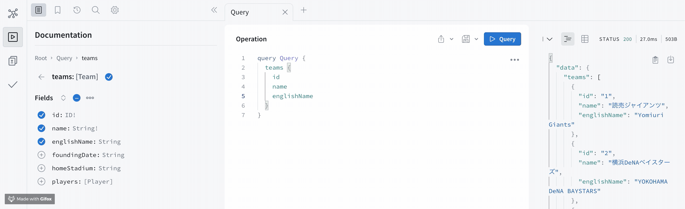
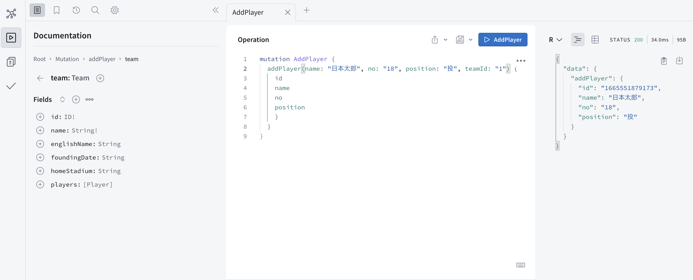

# 参考記事

[GraphQL Handson](https://graphql-handson-ozaki25.vercel.app/page3-2.html)
[React と Apollo で GraphQL を使った簡易 Todo リストを作成してみた](https://qiita.com/okumurakengo/items/ee1f9c8fb1bfa9fad797)
[Apollo 要約](https://zenn.dev/smish0000/articles/42a0d6e0522ffa)

# コマンド

## graphql サーバー起動

```sh
node index.js
```

→ [http://localhost:4000/](http://localhost:4000/)でみられるようになる

# playground での操作例

## query



## mutation

### add レコード


mutation 実行

  
query して追加を確認できる
