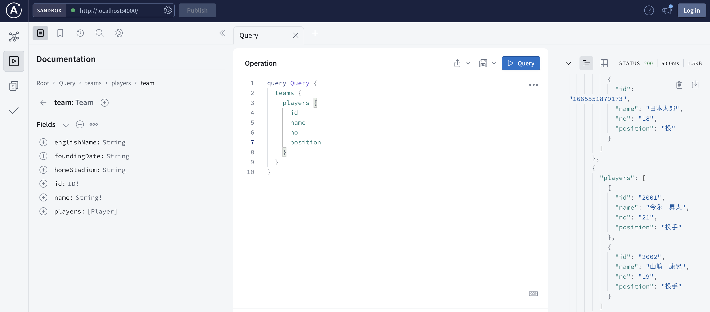

# 目次

<!-- TOC -->

- [目次](#目次)
- [参考記事](#参考記事)
- [コマンド](#コマンド)
  - [graphql サーバー起動](#graphql-サーバー起動)
- [playground での操作例](#playground-での操作例)
  - [query](#query)
  - [mutation](#mutation)
    - [create](#create)
    - [delete](#delete)
      - [src/schema.js](#srcschemajs)
      - [src/resolver.js](#srcresolverjs)
      - [src/service/PlayerService.js](#srcserviceplayerservicejs)
    - [update](#update)

<!-- /TOC -->

# 参考記事

- [GraphQL Handson](https://graphql-handson-ozaki25.vercel.app/page3-2.html)
- [【GraphQL】データを追加・削除・更新する](https://www.azukipan.com/posts/graphql-add-delete-edit/)
- [React と Apollo で GraphQL を使った簡易 Todo リストを作成してみた](https://qiita.com/okumurakengo/items/ee1f9c8fb1bfa9fad797)
- [Apollo 要約](https://zenn.dev/smish0000/articles/42a0d6e0522ffa)

# コマンド

## graphql サーバー起動

```sh
node index.js
```

→ [http://localhost:4000/](http://localhost:4000/)でみられるようになる

# playground での操作例

## query


## mutation

### create


mutation 実行

  
query して追加を確認できる

### delete

#### src/schema.js

```ts
  type Mutation {
    # delete
    deletePlayer(id: String!): Boolean!
  }
```

スキーマに型定義追加

#### src/resolver.js

```js
const teamService = require("./service/TeamService");
const playerService = require("./service/PlayerService");

const resolver = {
  // 〜略〜

  Mutation: {
    // create
    addPlayer: (_, player) => {
      return playerService.add(player);
    },

    // delete
    deletePlayer: (_, { id }) => {
      const res = playerService.delete(id);
      return res;
    },
  },
};

module.exports = resolver;
```

リゾルバの Mutation に削除時の挙動として、
service 層の関数呼び出し追加。

#### src/service/PlayerService.js

```js
const initPlayers = require("../data/players");

class PlayerService {
  constructor() {
    this.players = initPlayers;
  }

  // 〜略〜

  // 削除
  delete(id) {
    // 引数で受け取ったidを元に、該当idのplayerを除いたplayersの新しい配列作成
    const newPlayers = this.players.filter((player) => player.id !== id);

    // 削除してplayersの数が減っているか
    const isDelete =
      this.players.length - newPlayers.length === 1 ? true : false;

    // 新しい配列を既存のplayersと置き換え
    this.players = newPlayers;

    // 成功、失敗をreturn
    return isDelete;
  }
}

module.exports = new PlayerService();
```

service 層に削除処理追加

### update
